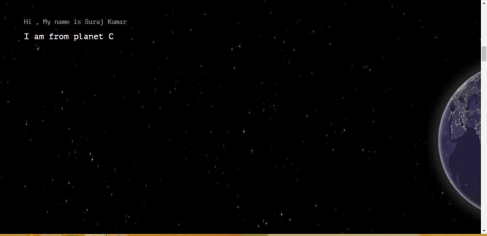

# Intro - 

I was just browsing for some inspiration for displaying a small story on a
website. Then I came across this concept of hijacking the scroll and make
the browser scroll divs as per my story. So I implemented the concept to 
design my about me page. Keep scrolling **slowly** and you are in for a fun Ride.

*There might be better ways of doing than what i did, feel free to comments a better approach but i belive any solution other than what i implemented would take mostly the same amount of resources.*

**The part that i love the most**

- the space effect and motion when you scroll , it just seems too good .

    

# Languages and libraries - 

Html , Css, Javascript , few Google fonts

# Code Concept and Details - 

**Concept behind scroll effect.**
There is no direct way of manipulating the vertical scroll of a browser. no
matter what you do it will scroll vertically it's a fundamental concept of
Html. 
But with the JS manipulating position and widths we can get the scroll effect.

First create few divs with position absolute or relative with width and height 
of `100%` or `100vw`. and add top values for each one such that they come
one after other if position is `absolute` otherwise 
`relative` will automatically place them one below other. 

Now due to this divs we have a vertical scroll, make opacity of these divs to 0.
Now you have a scroll with no elements. 

using javascrit you need to manupulate the other divs to move right,left,top,down any 
direction, using few simple formulaes.

value by which an element should change its top depending on `1px` scroll
> top per Scroll =  (Total top you want to move the Element)/((Total scroll in px)/100)*window.innerHeight

value by which an element should change its right position depending on `1px` scroll
> left per Scroll =  (Total left you want to move the Element)/((Total scroll in px)/100)*window.innerHeight

the same formulae goes for all the directions.

The method i used was to have all the divs position as `fixed ` and then manupulating their top and right
properties depending on above formulaes but there can be other options depending on the design you are
planning. 

There are a lot of functions in this project that you could directly re-use to make a similar peoject.

But the basic idea behind hijacking a scroll and running our own scroll effect is calculating the
change we need to do per `1px` scroll vertically.

**Some difficulties**
1. These kind of websites look very cool on Laptops and computers but it gets really fu***d in phones and tabs
half of my code deals with exceptions on small screens. The basic reason behind this is a feature that
is implemented in most of the modern browsers called asynchronous Scroll, where the browsers scroll the website
and display the contents of the webiste before firing the scroll event this results in unexpected part of
website being displayed and when the actual scroll event hits, things get repositioned and it looks glitchy.
I tried my best to cover up for all the glitches but i am still not satisfied by its performance in phones.
This is a major drawback so try finding workaround to as much extent as you can. 
`recommended - ` to have the feel of scrolling this website on computers and laptops.

2. dealing with SVG's to work properly on all screens, It took a lot of test and try to get the right
width, height and position for svg in all screens.

**Better Approach**
A better approach could have been making all the image of the site into one single giant svg. even with all of the assets combined the image wouldn't exceed 2mb size mark, which is a decent load size for a website. A lot
of issues that is caused due to  asynchronous Scroll could have been doched. and it would also be easy to position and zoom a single picture rather than handled multiple divs, monitoring and fixing all their exceptional case. The way i coded gets is a bit complicated but after having to solve all the issues and making it work I kind of don't want to re-write the code.