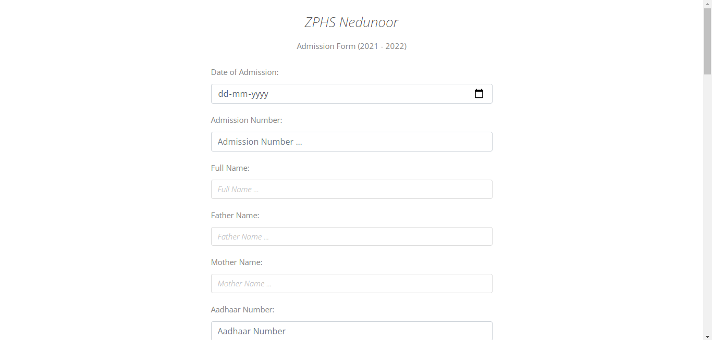

# Intro - 

[Demo Link](https://admission-form-zphs.herokuapp.com/)

A school did admissions on paper and it became very hard to print copies of forms and
finding a student details, so I implemented a server for them. This server return a 
HTML form to be filled with students details and then after submit server processes
the data and generates a pdf file with the details and send them to the user and also 
save the copy of the data into an excel file, which can be downloaded to search for
students details on later date. 

*There might be better ways of doing than what i did, feel free to comments a better approach, but i belive any solution other than what i implemented would take mostly the same amount of resources.*

**The part that i love the most**

- The Simple  desgin of the form. 

    

# Languages and libraries - 

Html , Css, Javascript , Bootstrap , Python, pptx(py library), openpyxl(py library), cloud convert api and few Google fonts

# Code Concept and Details - 

For this code to work you'll need a powerpoint(.pptx) file with
form design and an excel file which will be used to save every form 
entry.

The basic logic behind the code is
1. Express sends a file `index.html`
2. the form data is recieved and passed on to Python file auto.py to be processed.
3. in python the form gets added to excel file and also to pptx file.
4. the after python is done with adding data , javascript sends the pptx file 
   to cloud convert to convert pptx to pdf and the after recieving pdf it sends the
   pdf back to user.

THe problem with this approach is the server can handle only one Request at a time.
because the data needs to be written in a pptx file with gets converted to pdf. as there
is only one static pptx , the second request must wait for the first to complete.
pptx file can be created dynamically and the data can be written, allowing the server
to process more than one request at a time but the school wanted that only one student application be processed at once for some reasons , so let this approach be sued.
