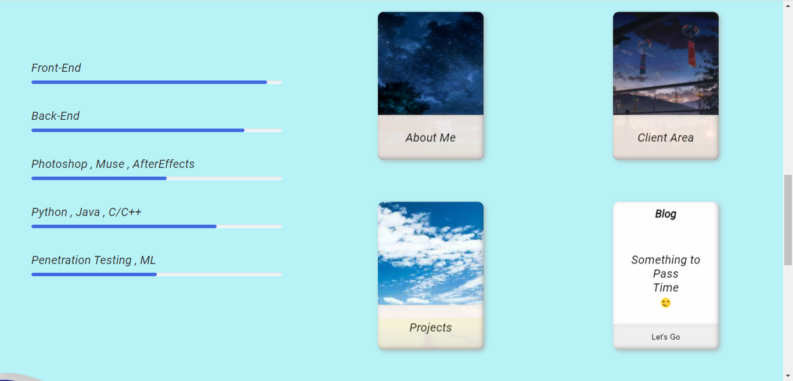
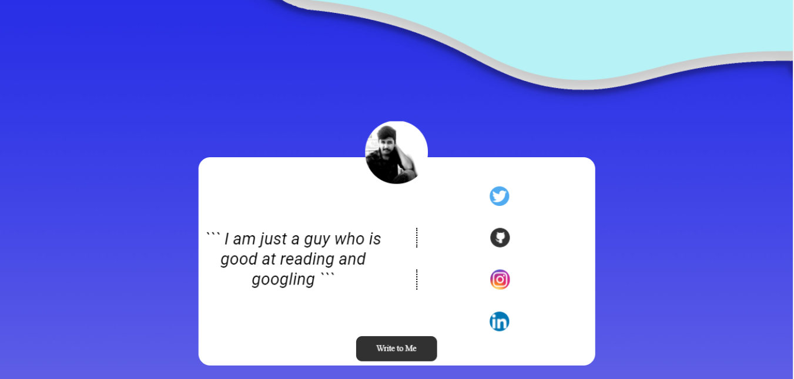

# Intro - 

This was the first homepage that i designed and coded as intro for 
myself. I named the website theme as Mysterious Land because it looks
like a blue land emerging from dark blue and white gradient space displaying
my details and links. 

*There might be better ways of doing than what i did, feel free to comments a better approach, but i belive any solution other than what i implemented would take mostly the same amount of resources.*

**The part that i love the most**

- the animation when you hover over the cards in below picture, it just feels very cool
when you keep shifting your mouse on different cards .

    

- The flip of the below card , if you notice properly when we click on *Write to me* the card flips and
the photo slides down together giving it a cool effect.
    

# Languages and libraries - 

Html , Css, Javascript , few Google fonts

# Code Concept and Details - 

All the positioning and styling of the elements are done using CSS.

The animation and motions of Divs are done using js.

**The flipping effect was a bit tricky and took a little reading and seraching to make to work in all browsers**

[Follow this link](https://www.w3schools.com/howto/howto_css_flip_card.asp) to learn about it.

No libraries are used except google fonts.

**What makes this website Stand out** is it's assets and color Scheme that are designed and 
positioned perfectly to give a very soothing effect while scrolling and hovering.

All the assets are Designed by me Using Adobe Photoshop and Adobe Illustrator.
