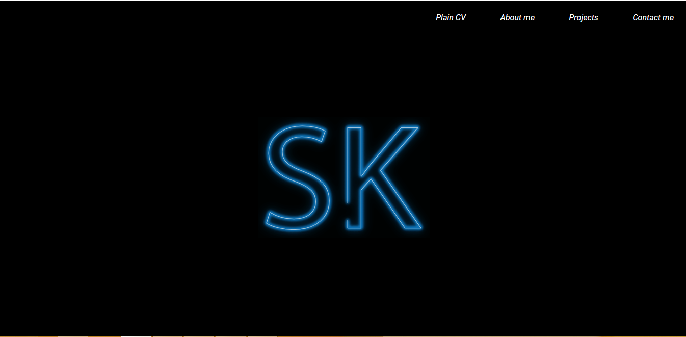

# Intro - 

This was my next Homepage after Homepage-1 (I know design degraded a bit). It's
a page that contains minimum components and direct Links. I name the Theme for the
website as Lights On (you'll know why when you visit the page ;-).

*There might be better ways of doing than what i did, feel free to comments a better approach but i belive any solution other than what i implemented would take mostly the same amount of resources.*

**The part that i love the most**

- Obviously , the Light flickering effect of the text SK. Open the page and you'll know

    

# Languages and libraries - 

Html , Css, Javascript , few Google fonts

# Code Concept and Details - 

The code is is pretty simple , just a synchronious way of displaying images for the
`Sk` flickering and position change on scroll event for the other slide effects 
in the page.

**Some difficulties**

1. blocking a scroll, this was a tought task, browsers does't have a direct feature for 
blocking the scroll in a page. 
I blocked the scroll by making `overflow:hidden` for the main element and then then to scroll
when animation is done. 