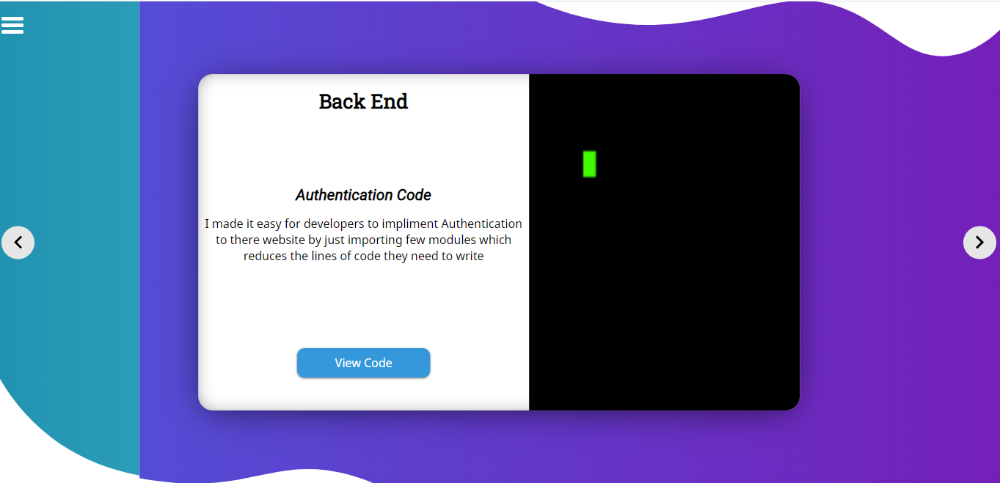

# Intro - 

This page displays all the projects mentioned in this repo with a more
appealing UI. Visit this site and you are up for some cool slides and
swipes.(Open the menu from top menu Icon). the simple idea behind this page 
was for users to view my projects swiping one by one, with a quick intro 
and link to read more about it or view a demo of it(If available).

*There might be better ways of doing than what i did, feel free to comments a better approach but i belive any solution other than what i implemented would take mostly the same amount of resources.*

**The part that i love the most**

- When select some other page from menu items and the slide animation that run from right to left hiding old content and displaying new content, that just looks super cool .

    

# Languages and libraries - 

Html , Css, Javascript , few Google fonts

# Code Concept and Details - 

If you ever used photoshop you might be aware of the term called `masking` . 
Similar thing happens here. 
I have two SVG coded in HTML , one is a rectangle with height and width `100%` used for 
hiding old page and displaying new page animation.
and other is a circle which basically hides and show Menu items.

*There is a property of CSS called `clip-path` which basically masks the contents of the component it is used in with the shape of SVG passed in its value.*

like i have a menu towards the right of the page. I created an svg which contains a 
circle, initially its radius is `0`. I used `clip-path` on menu with the circle SVG as
input, now when the page loads as the radius of SVG circle is 0, it masks the Menu 
and hides it when the page loads, when you click on menu icon the radius increases tp `150%`
gradually so the SVG Exapands and the area inside it displays the menu. giving an effect 
that menu is being displayed with a curved ending.

Something similar happens when you change pages and the cleaning effect comes up.

Rest have fun reading the code and figuring it out.

**Some difficulties**

1. The first and obvious issue will be dealing with SVG's they become pretty irritating.
2. The way safari executes SVG is completely different from other browsers so i did face
a lot of issues in safari browser while making this project work.
